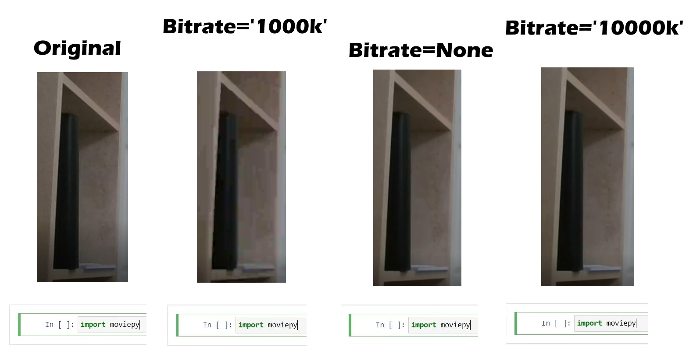

# Automatic Video Editing using Python
## How to implement voice control or remove silent moments from your video using Python libraries moviepy and vosk

Video editing is always tedious. Removing unnecessary video fragments is not a difficult task, but a long one. You need to review the video completely (and possibly more than once!), select all fragments you need, join them and then render the video for a long time. It usually takes more than three hours to simply edit an hour-long video! That's why I came up with this idea.

Of course, alternatives exist. For example, [wisecat](https://www.wisecat.video/), which can do much more than "video cutting". But I want to make a fast, simple, and free program. Python libraries [moviepy](https://zulko.github.io/moviepy/) and [vosk](https://alphacephei.com/vosk/) will help me with this.

## Problem Statement

I want to build a program that will automatically cut some video fragments and then join these fragments together. It has to receive data about these fragments in two ways:
- Automated (*partially automatic*, with some human intervention) - recognizing control words, and
- Automatic (*completely automatic*, without human intervention) - identifying long moments of silence

|  |
|:--:|
| <b>Two approaches to solving the automatic video editing problem. Image by Author</b>|

The task can be divided into the following subtasks:
1. Learn how to edit videos using moviepy
2. Recognize control words/silence and their timestamps
3. Connect these two components together

## Video Editing with Moviepy

First, let's just try to cut and join the video using the *moviepy* library.

It is very easy - after reading the source video into a `VideoFileClip` object we can do a lot of things with built methods. We will need the following ones:
- `video.subclip(start_seconds, end_seconds)` which returns video fragment, cut from `video` from `start_seconds` to `end_seconds`
- and `concatenate_videoclips(clips)` which join all video fragments from `clips` list.

Put the list of all `(start_seconds, end_seconds)` pairs you need in the `segments` variable. Now you can use the following code to produce a video from its fragments.

```python
import moviepy.editor as mp

video = mp.VideoFileClip("my_video.mp4")

# delete video fragment from 00:30 to 01:00
segments = [(0, 30),
            (60, None)]

clips = []  # list of all video fragments
for start_seconds, end_seconds in segments:
    # crop a video clip and add it to list
    c = video.subclip(start_seconds, end_seconds)
    clips.append(c)

final_clip = mp.concatenate_videoclips(clips)
final_clip.write_videofile("my_new_video.mp4")
final_clip.close()
```

In fact, this simple program can already be very useful. It copes well with simple tasks (trim the beginning/end of the video, cut the desired fragment), and works much faster than professional video editing programs (Sony Vegas, etc).

Now, all we have to do is to get these pairs (`segments`) from an intelligent system.

## A Brief Overview of Speech Recognition with Timestamps

This task is more complicated. As a result of searching and experimenting, I decided to use the [vosk API](https://alphacephei.com/vosk/). I described a detailed tutorial on how to implement speech recognition with timestamps in [this article](https://towardsdatascience.com/speech-recognition-with-timestamps-934ede4234b2). But I will try to briefly describe the most important points here too.

First of all, we need to recognize speech from our video file. As I explained in the article above, the vosk speech recognition model outputs a list of JSON dictionaries, that contains four parameters for each recognized word - `confidence`, `start time`, `end time` and recognized `word` (text). I created a custom `Word` class, which describes words according to this format. 

The following code recognizes `audio_filename` file using `model_path` vosk model and outputs a list of `Word` objects. 

```python
import wave
import json

from vosk import Model, KaldiRecognizer, SetLogLevel
import Word as custom_Word

model_path = "models/vosk-model-en-us-0.21"
audio_filename = "audio/speech_recognition_systems.wav"

model = Model(model_path)
wf = wave.open(audio_filename, "rb")
rec = KaldiRecognizer(model, wf.getframerate())
rec.SetWords(True)

# get the list of JSON dictionaries
results = []
# recognize speech using vosk model
while True:
    data = wf.readframes(4000)
    if len(data) == 0:
        break
    if rec.AcceptWaveform(data):
        part_result = json.loads(rec.Result())
        results.append(part_result)
part_result = json.loads(rec.FinalResult())
results.append(part_result)

# convert list of JSON dictionaries to list of 'Word' objects
list_of_Words = []
for sentence in results:
    if len(sentence) == 1:
        # sometimes there are bugs in recognition 
        # and it returns an empty dictionary
        # {'text': ''}
        continue
    for obj in sentence['result']:
        w = custom_Word.Word(obj)  # create custom Word object
        list_of_Words.append(w)  # and add it to list
        
# output to the screen
for word in list_of_words:
    print(word.to_string())
```

## Recognize Control Words

We know the time of pronouncing each word. That's great! Now we need to choose control words - there is room for creativity. We need two - for the start and the end of the cut fragment.

You can't just use *start* and *stop*. In fact, of course, you can, but you can't be sure that you won't say these words in your usual speech. And if you say, the program will work incorrectly. Initially, I decided to use some rare English words like *sagacious* and *egregious*. But it turned out that rare words are worse recognized, and very rare ones may not be in the dictionary at all. Also at this moment, I realized how much the accent affects speech recognition quality.  Because I'm not a native English speaker, I decided to move on to a simpler solution.

I decided to just use the words *start* and *end* in my native language. Since vosk has foreign models, you can recognize the English speech using your native language model. The text will be recognized as nonsense, but we don't need it, right? The main thing is that the *control words* will be recognized correctly. In Russian, they are written as **начало** and **конец**, and pronounced like **nachalo** and **konets**, respectively. The first word indicates the beginning of the fragment to be cut, and the second - its end.

|  |
|:--:|
| <b>Example of English speech recognition using a Russian model. Image by Author</b>|

It is also possible to recognize *combinations of English words* as control commands. You can go even further and recognize sounds - for example, finger clicks or clapping. However, it seemed less convenient to me.

Now we need to iterate through the `list_of_words` and check whether the recognized word is one of the control words. If yes, then we remember the time (start time for `start_word` and end time for `end_word`). I also created the `offset` variable to be sure that the cropping of the video is not too sharp.

```python
# list_of_Words received earlier

start_word = "начало"
end_word = "конец"
offset = 0.5  # in seconds

# lists for start and end times
starts = []
ends = []
# cycle by all Words
for w in list_of_Words:
    if w.word == start_word:
        starts.append(w.start - offset)
    if w.word == end_word:
        ends.append(w.end + offset)

# from starts and ends to segments
# starts = [1, 3], ends = [2, 4] ->
# segments = (0, 1), (2, 3), (4, None)
segments = []
length = max(len(starts), len(ends))
for i in range(length + 1):
    if i == 0:
        segments.append((0, starts[0]))
    elif i == length:
        segments.append((ends[i-1], None))
    else:
        # intermediate values
        segments.append((ends[i-1], starts[i]))
print("The search of control words is completed. Got the following array of segments: \n")
print(segments)
```

After that, all that remains is to pass the `segments` variable to the code snippet in **Video Editing with Moviepy** section!

## Recognize Silence

Another option is to cut out the moments when silence lasts longer than a certain threshold (for example 2 seconds). Almost everything here is already familiar to us.

```python
# list_of_Words received earlier

offset = 0.5  # in seconds
threshold = 2  # in seconds
# if silence lasts longer than treshold value, 
# this fragment will be cut

# lists for start and end times
starts = []
ends = []

for i in range(len(list_of_Words) - 1):
    current_word = list_of_Words[i]
    next_word = list_of_Words[i+1]
    if next_word.start - current_word.end > threshold:
        # find moment of silence
        starts.append(current_word.end + offset)
        ends.append(next_word.start - offset)

# from starts and ends to segments
# starts = [1, 3], ends = [2, 4] ->
# segments = (0, 1), (2, 3), (4, None)
segments = []
length = max(len(starts), len(ends))
for i in range(length + 1):
    if i == 0:
        segments.append((0, starts[0]))
    elif i == length:
        segments.append((ends[i-1], None))
    else:
        # intermediate values
        segments.append((ends[i-1], starts[i]))
print("The search of silence is completed. Got the following array of segments: \n")
print(segments)
```

This approach is fully automated and does not require any human intervention during or after video recording. You just specify the path to the video and get the video without silent moments.

## Final Program

The two main components of the program are ready to use, we need only to connect them. The only moment that was not described is the conversion of video to mono audio. But *moviepy* can easily cope with this.

```python
import moviepy.editor as mp

clip = mp.VideoFileClip("video.mp4")
# convert video to audio
# ffmpeg_params=["-ac", "1"] parameter convert audio to mono format
clip.audio.write_audiofile("audio.wav", ffmpeg_params=["-ac", "1"])
```

### Project Structure

The full program with detailed comments is available in [this GitLab repo](https://gitlab.com/Winston-90/automatic_video_editing/).
The project has the following structure:

```
automatic_video_editing
├───article
├───models
│   ├───vosk-model-en-us-0.21
│   └───vosk-model-ru-0.10
├───videos
│   .gitignore
│   
│   automatic_video_cutter.ipynb
│   automatic_video_cutter.py
│   Word.py
│
│   README.md
└── requirements.txt
```

It contains the following folders:
- The `article` folder contains the data for this tutorial.
- The `models` folder contains vosk models downloaded from [official site](https://alphacephei.com/vosk/models).
- The `videos` folder contains videos to be processed.
  
And code files:
- `Word.py` file describes the `Word` class.
- `automatic_video_cutter.ipynb` notebook contains a full program.
- `automatic_video_cutter.py` file contains the same full program but in the form of a python script. It can be used to run a program without [Jupyter Notebook](https://jupyter.org/).

See `README.md` for the user manual.

## Results and Conclusions

As a result, the program works as follows: 

Automatic Video Editing - Control Words on Youtube:

[](https://www.youtube.com/watch?v=Y8HlXMrDBrc)

Automatic Video Editing - Silence on Youtube:

[](https://www.youtube.com/watch?v=70EVCKNSsdI)

I am pleased with the result, but there are a lot of moments to discuss. 

### Supported Video Formats

First of all, about **supported formats**. This program uses *moviepy*, and *moviepy* supports all video extensions supported by *ffmpeg*: .ogv, .mp4, .mpeg, .avi, .mov, .mkv, etc.

### Execution Time

Next, about the execution time. I tested the program a few times with videos of different lengths (from 1 minute to 17). Based on these experiments, I can say that **the time of full video processing is less than the length of the original video file**. The execution time may vary depending on the hardware, but the proportions will be preserved.

|  |
|:--:|
| <b>Program execution time for a 17-minute video. Image by Author</b>|

First, you need to read the vosk model. But this stage is constant (does not depend on the length of the video) and takes about 30 seconds. Then there are four main stages of the program:
- **Convert Video to Audio** - executes not in constant time, but very quickly (less than 1 percent of the initial length of the video)
- **Speech Recognition using Vosk Model** - experiments have shown that you need about `0.2*X` seconds to recognize audio of length `X` seconds.
- **Analysis of Recognized Text, get `segments`** - executes instantly. I didn't notice the difference when processing a video one minute long and 17 minutes long.
- **Rendering** - the longest stage. With default parameters, its execution takes about `0.5*X` time.

## Video Quality

The question that arises after exploring the execution time is - what about the quality? After all, the faster the render, the worse the quality. And here the render is quite fast.

Yes, it is. The rendering is done using the `write_videofile` moviepy method, and it has a lot of parameters. I used its default values. 

I won't talk much about rendering, but the most important parameter is `bitrate`. Bitrate is the number of bits that are used to process the information in a given unit of time. The more bitrate you use, the better quality you get. At the same time, your file will be larger.

Default `bitrate` value is `None`, and it's about `'2000k'` (I couldn't find the exact value in the documentation, and found this value experimentally). Using this value, the video is **a bit compressed, but I don't notice any particular loss of quality**.

You can set the higher value to get better quality. This will also slow down rendering (but not too much). I conducted an experiment and rendered a video with a bitrate from `'1000k'` to `'10000k'` - the rendering time with the minimum and maximum values differed by 50%. That's how I found out the approximate default value.

|  |
|:--:|
| <b>Different bitrate values and output file sizes. Image by Author</b>|

If we calculate the file size by proportion (the initial video lasted 61 seconds and was 11.6 MB, and the processed one lasts 24 seconds), we get a value of 4.5 MB. So default bitrate is enough.

This can be also related to initial video quality. I used my webcam to record the video, so it's not very good. Below you can see the quality comparison. And if there is a difference for a webcam, then for screen capture even the lowest bitrate shows a good result.

|  |
|:--:|
| <b>The quality comparison for different bitrates. Image by Author</b>|

If you want to get more into this, you can start with [moviepy write_videofile method documentation](https://zulko.github.io/moviepy/ref/VideoClip/VideoClip.html#moviepy.video.VideoClip.VideoClip.write_videofile).

